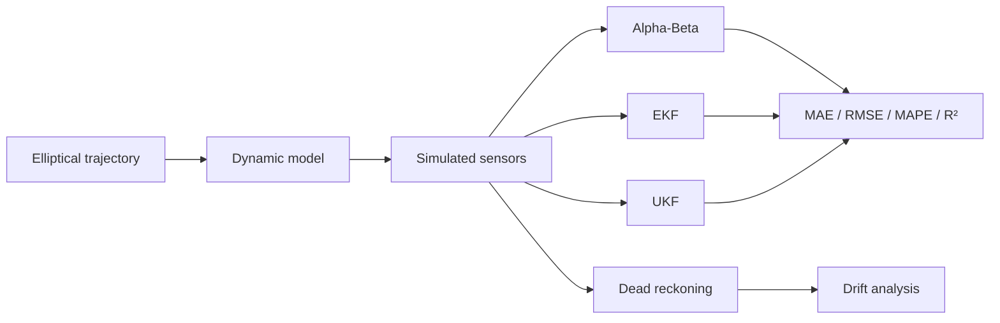

# Robot Localization through Sensor Fusion

[Português](README.md) | [English](README.en.md)

A mobile-robot localization simulation based on noisy GNSS, velocity and
gyroscope measurements. The notebook compares an Alpha-Beta filter with the
Extended Kalman Filter (EKF), Unscented Kalman Filter (UKF) and a dead-reckoning
baseline.

## Pipeline



The state vector is `x = [position_x, position_y, heading, velocity]`. GNSS
observes position, while velocity and turn rate drive the nonlinear motion
model. EKF linearizes the dynamics through a Jacobian; UKF propagates sigma
points with `filterpy`.

## What the notebook demonstrates

1. Generation of an elliptical trajectory with a gap and CSV export.
2. Robot-dynamics simulation and Gaussian observation noise.
3. Progressive dead-reckoning degradation due to heading drift.
4. GNSS measurement smoothing with Alpha-Beta.
5. EKF and UKF prediction/update cycles.
6. Visual trajectory comparison and quantitative evaluation.

## Stored results

| Filter | MAE | RMSE | MAPE | R² |
| --- | ---: | ---: | ---: | ---: |
| Alpha-Beta | **0.0854** | 0.1576 | **3.6276%** | 0.9995 |
| EKF | 0.1103 | **0.1360** | 17.4745% | **0.9996** |
| UKF | 0.1369 | 0.1672 | 15.9274% | 0.9994 |

Alpha-Beta achieved the lowest MAE and MAPE, while EKF recorded the lowest RMSE
and highest R². In this smooth, low-noise scenario, Alpha-Beta's simplicity is
an advantage; EKF and UKF become more valuable with stronger nonlinearities,
variable noise and multiple observation sources.

The results depend on random noise samples. The notebook does not set a global
seed, so new runs may produce slightly different figures.

## Run locally

```bash
python3 -m venv .venv
source .venv/bin/activate
python -m pip install --upgrade pip
python -m pip install -r requirements.txt
jupyter lab FIAD_projeto.ipynb
```

Run the cells in order. `trajectory_filtered.csv` and
`simulated_trajectory.csv` are generated during execution and do not need to
exist beforehand.

## Repository structure

```text
robot-localization-sensor-fusion/
├── FIAD_projeto.ipynb
├── requirements.txt
├── README.md
└── README.en.md
```

## Skills demonstrated

Sensor fusion, state estimation, nonlinear systems, EKF, UKF, Alpha-Beta,
dead reckoning, simulation, noise modelling and trajectory evaluation.

## Academic context

Developed by José Cunha and José Filipe for Information Fusion in Data Analysis
in 2025. This is an educational simulation, not navigation software validated
for a physical robot.
