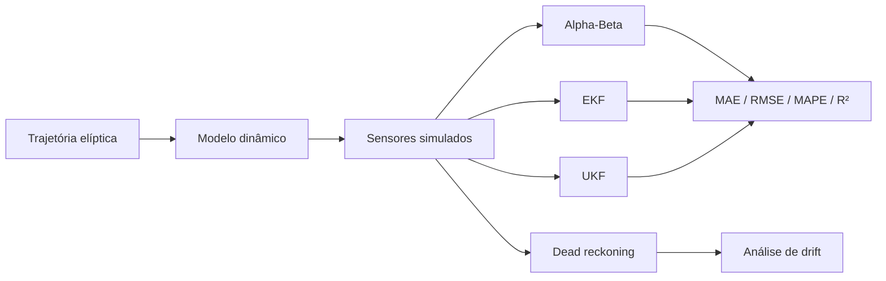

# Localização de Robôs por Fusão de Sensores

[Português](README.md) | [English](README.en.md)

Simulação de localização de um robô móvel através da fusão de medições ruidosas
de GNSS, velocidade e giroscópio. O notebook compara um filtro Alpha-Beta com o
Extended Kalman Filter (EKF), Unscented Kalman Filter (UKF) e uma baseline de
dead reckoning.

## Pipeline



O vetor de estado é `x = [posição_x, posição_y, orientação, velocidade]`. O GNSS
observa a posição, enquanto velocidade e rotação alimentam o modelo de movimento
não linear. O EKF lineariza a dinâmica através do Jacobiano; o UKF propaga
pontos sigma com `filterpy`.

## O que o notebook demonstra

1. Geração de uma trajetória elíptica com uma lacuna e exportação para CSV.
2. Simulação da dinâmica do robô e de ruído Gaussiano nas observações.
3. Degradação progressiva do dead reckoning devido ao erro de orientação.
4. Suavização das medições GNSS com Alpha-Beta.
5. Ciclos de predição/atualização do EKF e UKF.
6. Comparação visual das trajetórias e avaliação quantitativa.

## Resultados guardados no notebook

| Filtro | MAE | RMSE | MAPE | R² |
| --- | ---: | ---: | ---: | ---: |
| Alpha-Beta | **0,0854** | 0,1576 | **3,6276%** | 0,9995 |
| EKF | 0,1103 | **0,1360** | 17,4745% | **0,9996** |
| UKF | 0,1369 | 0,1672 | 15,9274% | 0,9994 |

O Alpha-Beta obteve o menor MAE e MAPE, enquanto o EKF apresentou o menor RMSE
e maior R². Neste cenário suave e pouco ruidoso, a simplicidade do Alpha-Beta é
uma vantagem; os benefícios do EKF e UKF tornam-se mais relevantes com dinâmica
mais não linear, ruído variável e múltiplas fontes de observação.

Os valores dependem das amostras aleatórias de ruído. Como o notebook não fixa
uma seed global, uma nova execução pode produzir números ligeiramente diferentes.

## Executar

```bash
python3 -m venv .venv
source .venv/bin/activate
python -m pip install --upgrade pip
python -m pip install -r requirements.txt
jupyter lab FIAD_projeto.ipynb
```

Execute as células pela ordem apresentada. Os ficheiros
`trajectory_filtered.csv` e `simulated_trajectory.csv` são gerados durante a
execução e não precisam de existir previamente.

## Estrutura

```text
robot-localization-sensor-fusion/
├── FIAD_projeto.ipynb
├── requirements.txt
├── README.md
└── README.en.md
```

## Competências demonstradas

Fusão de sensores, estimação de estado, sistemas não lineares, EKF, UKF,
Alpha-Beta, dead reckoning, simulação, modelação de ruído e avaliação de
trajetórias.

## Contexto académico

Projeto apresentado no portefólio de **José Cunha**, desenvolvido para Fusão de
Informação em Análise de Dados, em 2025. A autoria académica completa encontra-se
no trabalho original. Trata-se de uma simulação educativa, não de software de
navegação validado para um robô físico.
